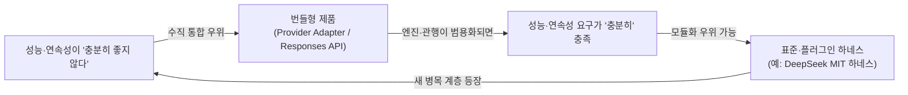

# Astra 기사에서 읽히는 컴퓨터 발전사의 반복 패턴

> 원글: [OpenAI의 Astra가 진짜 팔고 있는 건 무엇인가](https://turingpost.co.kr/p/openai-astra) (Turing Post Korea, 2026-09-08)

---

## 기사 핵심 요약

GPT-6 Astra가 ARC-AGI-3에서 **표준 하네스 62.7% vs. OpenAI Provider Adapter 99.9%**라는 두 점수를 받았다. 같은 모델인데 **실행 환경(하네스)**이 다르니 성능이 극적으로 갈렸다. 기사는 이 격차를 **"하네스 프리미엄"**이라 명명하고, 기업이 모델 단독 점수가 아닌 *모델 + 실행 환경* 전체를 제품으로 평가해야 한다고 주장한다. 그리고 OpenAI(번들형)와 DeepSeek(오픈·플러그인형)의 대조를 통해 *벤더 종속 vs. 운영 자주*의 트레이드오프를 제시한다.

중요한 단서(원글·ARC Prize와 동일): 표준 하네스는 공정 비교를 위해 **기능을 최소화한 기준선**이고, Provider Adapter는 여러 기능을 묶은 **제품형 실행 환경**이다. 따라서 62.7↔99.9 구간 전체를 “OpenAI만의 고유 마법”이라고 읽으면 안 된다. 기사가 보여주는 것은 보편적 기여율이 아니라, **모델 이름·단독 점수만으로 실제 제품 성능을 판단해서는 안 된다**는 점이다.

---

## 1. 반복되는 패턴: "실행 환경이 성능을 결정한다"는 재발견

이 기사에서 일어나는 일을 한 문장으로 추상화하면 이렇다:

> **핵심 연산 엔진(모델)의 원시 성능만으로는 최종 결과를 설명할 수 없고, 그것을 감싸는 실행 환경—특히 상태·메모리를 어떻게 이어 주는지—이 관측 성능을 크게 좌우한다. 그 계층의 통제권을 놓고 번들형 최적화와 모듈형 이식성이 경쟁한다.**

이것은 컴퓨터 역사에서 **여러 차례** 비슷한 구조로 나타난 패턴이다. 다만 “래퍼가 언제나 엔진을 이긴다”는 법칙은 아니다. **병목이 엔진에 있으면** 래퍼만으로는 살리지 못하고, **병목이 연속성·오케스트레이션·생태계에 있으면** 실행 환경이 점수를 먹는다. Astra 사례는 후자에 가깝다.

---

## 2. 네 번의 반복 (유사 구조, 다른 동력)

### 2-1. 하드웨어 → OS (1960–80년대)

| 요소 | 대응 |
|---|---|
| **핵심 엔진** | CPU (IBM 360, DEC PDP 등) |
| **실행 환경** | 운영체제 (OS/360 → UNIX → DOS/Windows) |
| **"하네스 프리미엄"에 해당하는 현상** | 같은 CPU라도 어떤 OS 위에서 돌리느냐에 따라 응용 성능·호환성·생태계 접근성이 달랐다. |
| **번들 vs. 분리** | IBM은 오랫동안 하드웨어와 소프트웨어를 함께 팔다가, **1969년 소프트웨어 언번들링**을 발표했다. 동력에는 반독점·규제 압력이 크게 작용했다. 그 이후 UNIX/BSD/Linux 같은 이식 가능한 OS 계층이 커졌지만, “언번들링 = 곧 오픈 하네스의 승리”로 단순화하면 과하다. |
| **교훈** | OS·플랫폼 계층이 하드웨어 위에서 **독립적 시장·가치**를 형성할 수 있다. 다만 분리를 만든 힘은 기술만이 아니라 제도·계약·표준이기도 하다. |

### 2-2. 런타임 전쟁: JVM vs. .NET vs. 네이티브 (1990–2000년대)

| 요소 | 대응 |
|---|---|
| **핵심 엔진** | 프로그래밍 언어·컴파일러·ISA |
| **실행 환경** | JVM, .NET CLR, 브라우저 JS 엔진 |
| **"하네스 프리미엄"에 해당하는 현상** | 같은 알고리즘이라도 JIT, GC, 클래스로더, 런타임 서비스에 따라 관측 성능이 크게 달라질 수 있다. "Write Once, Run Anywhere"는 실무에서 종종 "Write Once, **Tune** Everywhere"가 되었다. |
| **번들 vs. 오픈** | 초기의 벤더 중심 런타임이 이후 OpenJDK, .NET Core/5+처럼 더 열린 형태로 이동한 사례가 있다. |
| **참고** | 컴파일러·런타임 자체도 “엔진(ISA) 위의 하네스”다. 같은 소스라도 도구 체인에 의미가 갈릴 수 있다는 점은, 모델 점수와 하네스 점수를 분리해 읽어야 한다는 주장과 통한다. |

### 2-3. 클라우드 플랫폼: IaaS → PaaS 종속 (2010년대)

| 요소 | 대응 |
|---|---|
| **핵심 엔진** | 가상 서버(EC2, GCE, VM) |
| **실행 환경** | 매니지드 서비스 계층 (Lambda, DynamoDB, Cloud Functions, SageMaker…) |
| **"하네스 프리미엄"에 해당하는 현상** | 같은 워크로드를 VM에 직접 올리는 것과 매니지드 오케스트레이션에 올리는 것의 성능·비용·운영 부담 격차. 편의와 성능이 커질수록 **이동(migration) 비용**도 커질 수 있다. |
| **번들 vs. 오픈** | 클라우드 벤더 PaaS vs. Kubernetes·Terraform·CNCF 같은 이식 가능한 추상화 계층 |
| **교훈** | “클라우드 네이티브”의 일부는 특정 벤더 런타임에 대한 의존이었다. 멀티클라우드 전략의 핵심은 맹목적인 이탈이 아니라, **무엇을 이식 가능한 계층에 둘지**를 고르는 것이었다. |

### 2-4. AI 모델 → 에이전트 하네스 (2024–현재) ← **지금 여기**

| 요소 | 대응 |
|---|---|
| **핵심 엔진** | LLM (예: GPT-6 Astra 등) |
| **실행 환경** | 에이전트 하네스 (컨텍스트 관리, 메모리 지속, 도구 호출, 실패 복구 루프) |
| **"하네스 프리미엄"에 해당하는 현상** | Astra: 표준 하네스 62.7% vs Provider Adapter 99.9% (Adapter는 reasoning none이어도 96.7%). **갈리는 축은 “얼마나 오래 생각하느냐”보다 “상태를 어떻게 이어 주느냐”에 가깝다.** |
| **번들 vs. 오픈** | OpenAI Responses API 쪽 번들형 실행 환경 vs DeepSeek가 MIT로 공개한 플러그인형 하네스 (`Agent = Model + Harness`) |
| **비교 시 주의** | NVIDIA AVO가 같은 모델을 다른 에이전트 구성으로 크게 끌어올렸다는 **방향성** 사례는 참고할 만하다. 다만 원글도 지적하듯 측정 조건이 다르면 점수 차를 “하네스의 순수 기여분”으로 단정할 수 없다. |

---

## 3. 공통 흐름을 읽는 추상화 프레임워크

### 가장 먼저 볼 축: **상태 연속성 (continuity of state)**

Astra에서 표준 하네스는 환경 상태와 행동 목록 정도만 주고, 앞 단계의 발견을 남기려면 모델이 **명시적 쪽지(노트)**에 의존한다. Provider Adapter는 요청 사이에 **불투명한 추론 상태**를 보존·압축한다. 같은 가중치라도 cold start에 가깝게 도는지, warm continuation으로 도는지가 갈린다.

그래서 이 사례의 1차 설명은 “래퍼가 엔진을 이겼다”보다 다음이 정확하다.

> **관측 성능의 상당 부분은 ‘연속성을 누가·어디에 두느냐’에서 나온다.**  
> 쪽지만 허용하는 최소 하네스 vs 내부 상태를 인프라가 이어 주는 제품 하네스.

### 🔄 "래핑 레이어의 가치 포획 사이클" (Value-Capturing Wrapper Cycle)

역사 사례를 하나의 사이클로 묶으면 대략 이렇다. (③은 필수가 아니라 **병목이 래퍼 쪽으로 옮겨질 때** 나타난다.)

```
① 새로운 핵심 엔진 등장 → 원시 성능에 주목
     ↓
② 실행 환경/래퍼 계층이 점점 정교해짐 (특히 상태·스케줄·도구)
     ↓
③ (조건부) 관측 성능·전환비용에서 래퍼의 기여가 커지는 교차점
     ↓
④ 엔진 제공자가 래퍼를 번들로 묶어 제품 경계를 재정의 (수직 통합)
     ↓
⑤ 오픈/표준 대안이 래퍼를 모듈화해 엔진 교체 가능성을 높임
     ↓
⑥ 시장이 "번들형 최적화" vs. "모듈형 이식성" 으로 양분
     ↓
⑦ 장기적으로 래퍼 계층이 독립 산업·평가 단위로 성장할 수 있음
```

### 적용 가능한 기존 개념들

| 개념 | 설명 | Astra 사례 적용 |
|---|---|---|
| **상태 연속성 / 메모리 계층의 위치** | 중간 결과를 어디에 두느냐(명시 노트 vs 불투명 세션 상태 vs 외부 DB)가 관측 성능을 가른다 | 표준 하네스: 모델이 쪽지로 기억을 재구성. Adapter: 인프라가 추론 상태를 이어 줌 |
| **Joel Spolsky의 "Leaky Abstractions"** | 추상화는 새고, 새는 지점이 비용을 만든다 | “모델 점수”라는 한 줄 추상화가 하네스 차이를 가리면, 조달·벤치마크·계약이 새는 지점이 된다 |
| **Clayton Christensen의 모듈화–통합 진자** | 성능이 "충분히 좋지 않을 때" 수직 통합이 유리, "충분히 좋을 때" 모듈화가 유리해질 수 있다 | 에이전트 과제가 아직 어렵고 상태 관리가 병목이면 번들형 실행 환경이 두드러진다 |
| **플랫폼 종속 (Vendor Lock-in)** | 전환 비용이 높아 공급자 이동이 어려워지는 상태 | Adapter급 연속성·도구에 맞춰 짤수록, 다른 환경에서 같은 점수를 재현하기 어려워질 수 있다 |
| **"Worse is Better" (조건부)** | 단순·이식 가능한 설계가 장기적으로 이길 *수* 있다 | DeepSeek식 분리 하네스가 이기려면, 단순함만으로는 부족하고 **Adapter급 연속성을 재현·근접**할 수 있어야 한다. 못 하면 “Worse is Just Worse”다 |
| **프로세스 상태 보존과의 동형** | OS가 프로세스 컨텍스트를 보존하듯, 에이전트 런타임이 추론 상태를 보존한다 | Provider Adapter의 요청 간 상태 보존 ≈ 세션/프로세스 연속성. 쪽지 방식 ≈ 매번 재시작 후 사용자가 남긴 파일만 읽기 |

> 참고: 고전적 **추상화 역전(abstraction inversion)** — 하위가 제공해야 할 기능을 상위가 다시 구현하는 안티패턴 — 은 여기와 분위기만 비슷하다. 표준 하네스의 “모델이 메모를 스스로”는, 상위가 하위를 재발명했다기보다 **평가용 최소 환경이 상태 계층을 모델에게 떠넘긴 설계**에 가깝다.

---

## 4. 가장 강력한 단일 렌즈: **"모듈화–통합 진자"** (+ 상태 연속성)

산업 구도(번들 vs 오픈)를 읽는 데는 **Christensen의 모듈화–통합 진자**가 여전히 유용하다. 다만 Astra *점수 격차 자체*를 설명하는 1차 렌즈는 **상태 연속성**이다. 진자는 “지금 시장이 왜 통합 쪽으로 기울어 보이는가”를, 연속성은 “두 점수가 왜 갈렸는가”를 담당한다.



**지금 에이전트 벤치마크·제품 경쟁의 일부는 진자의 통합 쪽에 있다.** 과제가 어렵고 상태 관리가 병목이면, 하네스까지 묶은 벤더가 관측 점수에서 두드러지기 쉽다. 모델과 연속성 관행이 범용화되면 하네스는 분리·표준화될 여지가 있고, 그때 가치는 다시 **그 위 계층**(도메인 오케스트레이션, 업무 프로세스, 평가·거버넌스)으로 이동할 수 있다.

오픈 하네스가 “이기려면” 단순 공개만으로는 부족하다. **불투명 상태 보존에 가까운 연속성**을 합법적·이식 가능한 형태로 얼마나 재현하느냐가 관건이다.

---

## 5. 기업이 이 프레임워크에서 얻을 수 있는 실무 질문

기사가 제시한 질문을 역사·연속성 프레임 위에 재배치하면:

1. **우리는 진자의 어느 쪽에 있는가?** — 우리 업무에서 모델 원시 성능만으로 충분한가, 아니면 상태 보존·도구·복구까지 묶어야 하는가?
2. **전환 비용을 얼마나 쌓고 있는가?** — 벤더 실행 환경의 어느 부분이 점수·비용을 만드는지 재지 않고 있으면, 나중에 옮길 때 무엇이 사라질지 모른다.
3. **래퍼 계층을 별도 평가 단위로 보고 있는가?** — 기준값(공통 최소 환경), 진단값(벤더 기능 on/off), 대안 하네스 실측값을 섞어 읽지 않는가? (원글의 구분)
4. **쪽지로 충분한 일과, 내부 상태 보존이 필수인 일을 가르고 있는가?** — 전자는 모듈 하네스가 유리해질 여지가 크고, 후자는 당분간 번들 프리미엄이 남을 수 있다.

---

<div class="callout-box info">
  <div class="callout-title">한 줄 요약</div>
  <p>Astra의 “두 점수”는 모델 IQ 한 줄이 아니라 <strong>모델 + 실행 환경(특히 상태 연속성)</strong> 의 성적표다. 컴퓨터사에서 반복된 “엔진 위 래퍼의 가치·통제권 경쟁”의 최신형이며, 점수 격차는 <strong>연속성</strong>으로, 산업 구도는 <strong>모듈화–통합 진자</strong>로 읽는 편이 안전하다. 격차 전체를 특정 벤더의 고유 프리미엄으로 단정하지 말고, 우리 업무에서 기준값·대안 하네스를 다시 재야 한다.</p>
</div>
